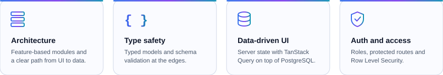

 

My GitHub is where I turn curiosity about software into practical work. I build applications to explore ideas, work through real implementation challenges, and understand the decisions that shape how software is put together.

Rather than following a fixed recipe, I enjoy exploring different approaches, understanding their trade-offs, and learning from the process of building something functional.

 

## Selected Projects

<table>
  <tr>
    <td width="50%" valign="top">
      
      
<a href="https://failstack.vercel.app"><b>Live demo →</b></a>

    </td>
    <td width="50%" valign="top">
      
      
<a href="https://devdesk-omega.vercel.app"><b>Live demo →</b></a>

    </td>
  </tr>
  <tr>
    <td width="50%" valign="top">
      
      
<a href="https://form-flow-phi.vercel.app"><b>Live demo →</b></a>

    </td>
    <td width="50%" valign="top">
      
      
<a href="https://nexus-os-dashboard-seven.vercel.app"><b>Live demo →</b></a>

    </td>
  </tr>
</table>

Explore the source code through each project card. Demo access details are available in the individual project READMEs.

 

## Engineering Focus

 

## Technologies & Tools

 

## Connect

  <a href="https://ali-jalili.vercel.app/">Portfolio</a>
  ·
  <a href="https://www.linkedin.com/in/ali--jalili">LinkedIn</a>
  ·
  <a href="mailto:ali.jalili.dev@gmail.com">Email</a>

 

